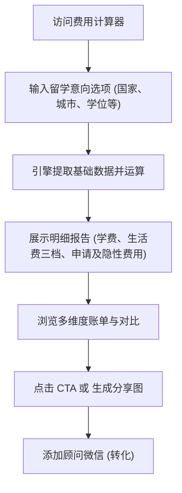

## 1. 产品概述
为“河狸陪”品牌的潜在客户（家长、学生、预算敏感型人群）提供快速、多维度的留学费用估算服务。
- 解决用户在决策初期对“留学到底花多少钱”、“哪个国家性价比更高”的焦虑，提供前期费用摸底。
- 核心商业目标：作为高频入口工具，通过“预算有限？让规划师帮你找到性价比最高的方案”等引导文案，促使用户添加微信进行 1v1 免费咨询，衔接核心背景提升/留学申请业务。

## 2. 核心功能

### 2.1 核心模块
1. **条件输入模块**：支持用户选择目标国家（美/英/港/新/澳/加/德/日）、城市、学位层次（本/硕/博）、学校类型（公立/私立），并动态生成预估学制年限和住宿偏好选项。
2. **费用计算与报表生成模块**：基于内置的数据字典，分别计算：
   - **学费（Tuition & Fees）**
   - **生活费（Living Expenses）**：含住宿、餐饮、交通、通讯、日用，并按“节省/适中/宽裕”三档呈现。
   - **申请阶段费用**与**隐性费用**。
3. **多国对比功能**（MVP简化版/后续迭代）：展示不同国家/地区的总花费差异。
4. **CTA 转化与分享模块**：展示引导文案并弹窗企微二维码，支持一键生成带水印的分享卡片（传播获客）。

### 2.2 页面细节
| 页面名称 | 模块名称 | 功能描述 |
|-----------|-------------|---------------------|
| 费用计算器 | 头部与说明区 | 页面标题，简单说明和使用引导 |
| 费用计算器 | 核心条件录入区 | 表单选项，包含国家、城市（根据国家联动）、学位层次、学校类型、学制、住宿偏好 |
| 费用计算器 | 报告展示区 | 计算后动态显示的汇总费用面板，拆解学费、生活费、申请费和隐性费用，对比节省、适中、宽裕三套方案 |
| 费用计算器 | 底部 CTA 及分享 | 包含“获取高性价比规划”等按钮，引导添加企微，同时支持生成长图分享 |

## 3. 核心流程
用户访问页面 → 依次选择国家、城市、学位等核心维度 → 实时生成或点击生成详细费用清单 → 浏览三档总费用对比 → 底部被 CTA 吸引，点击“获取 1v1 背景评估”或保存截图 → 添加微信完成留资转化。

## 4. 用户界面设计
### 4.1 设计风格
- 延续“河狸陪”品牌规范，主色调：Primary Blue (#1D4ED8)
- 强调色：Accent Green (#16A34A) 用于费用较低的推荐项，Accent Orange (#F97316) 用于高亮提示
- 中性色：Deep Text (#0F172A), Dark Gray (#334155), Mid Gray (#64748B), Light Gray (#CBD5E1), 背景色 (#F1F5F9)
- 图表与数据展示要求：大字号清晰展示总金额，卡片内部分栏或环形图/柱状图展示费用结构。

### 4.2 页面设计概览
| 页面名称 | 模块名称 | UI 元素 |
|-----------|-------------|-------------|
| 计算器首页 | 选项录入区 | 清爽的网格表单（Select / Radio Buttons），交互流畅的联动更新 |
| 计算器首页 | 费用账单卡片 | 数据大屏感，使用分栏展示“节省 / 适中 / 宽裕”三个区间的总金额及细项柱状对比 |
| 计算器首页 | CTA 引导卡片 | 品牌蓝按钮、诱导性文案、二维码弹窗设计 |

### 4.3 响应式设计
采用移动端优先理念，桌面端左侧表单、右侧账单报告；移动端上下堆叠。所有输入控件区域放大，便于手机触控。
