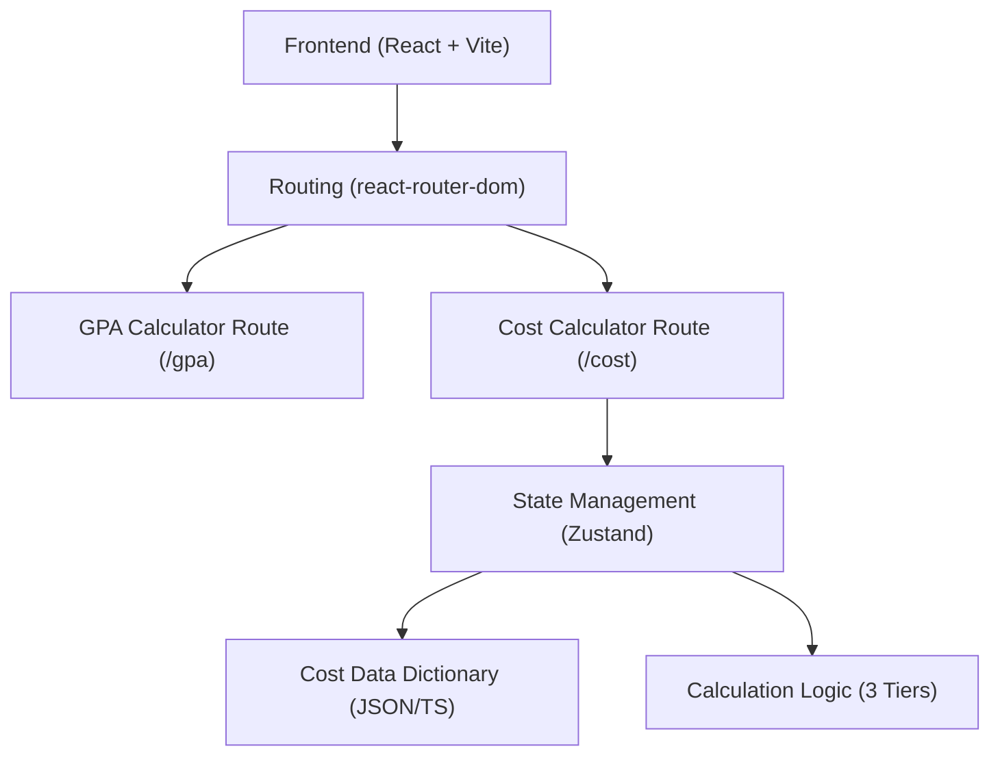

## 1. 架构设计


## 2. 技术说明
- 前端：React@18 + tailwindcss@3 + vite
- 路由方案：`react-router-dom`（用于管理现有的 GPA 计算器和新增的留学费用计算器）。
- 样式方案：TailwindCSS + CSS Variables (遵循“河狸陪”品牌设计规范，已有的配置继续复用)。
- 部署方案：纯静态前端部署，本地维护费用字典文件，后续可通过 JSON 文件更新汇率和学费基数。
- 截图生成：`html-to-image` 插件复用于分享卡片。

## 3. 路由定义
| 路由 | 目的 |
|-------|---------|
| / | 导航页/入口页（提供前往 GPA 和 费用计算器的入口） |
| /gpa | 原有的 GPA 换算器工具 |
| /cost | 留学费用计算器工具（核心录入、计算和展示逻辑） |

## 4. 核心数据结构与算法设计
### 4.1 基础数据字典结构 (Cost Dictionary)
```typescript
interface CountryData {
  id: string;
  name: string;
  currency: string;
  exchangeRate: number; // 相对人民币汇率
  cities: CityData[];
  degrees: Record<string, DegreeCost>; // 学位学费区间及默认学制
  applicationFee: number; // 申请费基数
  hiddenFee: number; // 隐性费用基数
}

interface CityData {
  id: string;
  name: string;
  livingMultiplier: number; // 城市生活费系数
  accommodationBase: number; // 住宿费基准
}

interface DegreeCost {
  publicTuition: number; // 公立学费均值
  privateTuition: number; // 私立学费均值
  defaultDuration: number; // 默认学制年限
}
```

### 4.2 计算逻辑设计
1. **学费计算**：根据选择的国家、学位层次和公私立类型获取基数，乘以学制年限，再乘以汇率得出人民币总额。
2. **生活费计算**：根据国家基准和城市系数，加上住宿偏好的加权，得出三档（节省/适中/宽裕）的年生活费，乘以学制和汇率。
3. **申请及隐性费用**：按国家标准定额输出。
4. **总计汇总**：学费 + 生活费（三档） + 申请费 + 隐性费用，最后展示总清单。
