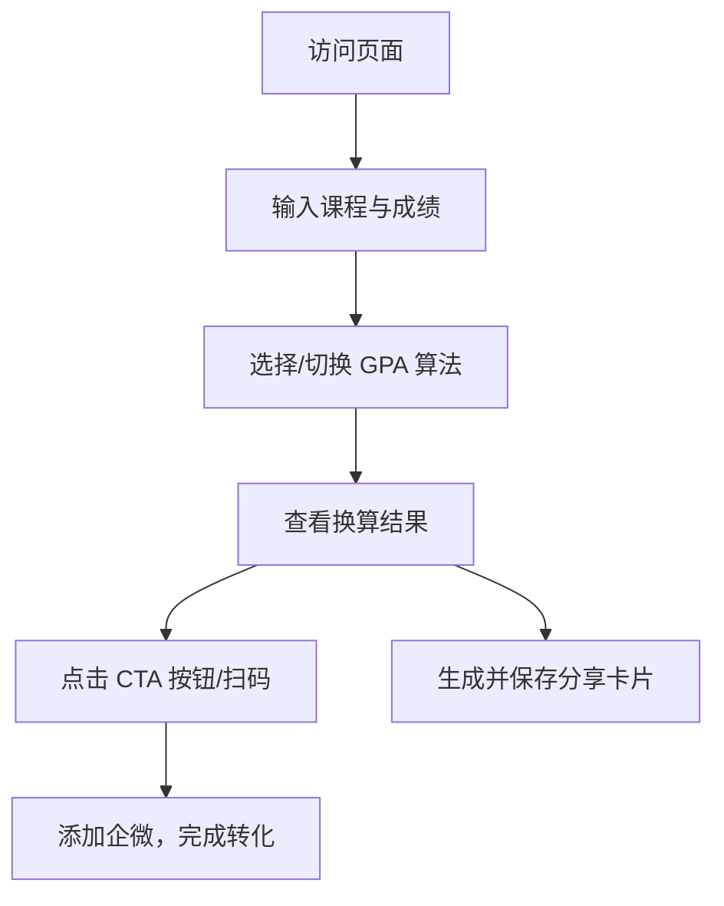

## 1. 产品概述
为“河狸陪”品牌的潜在客户（大学生、高中生、已工作人群）提供快速、多算法的 GPA 换算服务。
- 解决用户在留学申请、保研等场景下准确评估自身 GPA 竞争力的痛点，同时提供选校参考。
- 核心商业目标：通过高频刚需工具吸引精准流量，通过“你的 GPA 能申哪些学校？”等增值内容自然引导用户添加微信，实现获客转化。

## 2. 核心功能

### 2.1 核心模块
1. **成绩输入模块**：支持用户动态添加/删除课程，输入各科成绩和学分。
2. **GPA 计算模块**：支持 7 种主流算法（标准4.0、北大4.0、改进4.0版1、改进4.0版2、加拿大4.3、中科大4.3等）。
3. **结果展示与分享模块**：实时展示换算结果，支持多算法对比，并提供分享卡片生成功能。
4. **CTA 转化模块**：结合 GPA 结果展示动态引导文案和企微二维码，促成私域留资。

### 2.2 页面细节
| 页面名称 | 模块名称 | 功能描述 |
|-----------|-------------|---------------------|
| 首页 | 头部区 | 品牌 Logo，工具标题与简短说明 |
| 首页 | 成绩输入区 | 列表/表格形式输入课程名称、学分、成绩，支持批量清空和示例数据填充 |
| 首页 | 算法选择与结果区 | 切换不同 GPA 算法，实时展示对应结果和算法规则 |
| 首页 | CTA 转化区 | 根据 GPA 区间展示不同的转化文案（如“测测你的GPA能申哪所名校”）与微信二维码 |

## 3. 核心流程
用户通过搜索引擎或小红书访问页面，输入课程数据，选择目标算法，获得结果后，被引导添加微信获取定制方案。

## 4. 用户界面设计
### 4.1 设计风格
- 品牌主色：Primary Blue (#1D4ED8)
- 中性色：Deep Text (#0F172A), Dark Gray (#334155), Mid Gray (#64748B), Light Gray (#CBD5E1), White (#FFFFFF), 背景色 (#F1F5F9)
- 强调色：Accent Green (#16A34A) 用于成功/增长, Accent Orange (#F97316) 用于提示性高亮
- 语义色：Warning (#F59E0B), Error (#DC2626)
- 字体排版：
  - Display (40-48pt, weight 800-900)
  - Headline (28-32pt, weight 700-800)
  - Title (20-24pt, weight 600-700)
  - Body (14-16pt, weight 400-500)
  - Label (12-14pt, weight 500-600)
- 布局风格：极简、现代、强调数据清晰度，留白充足（浅灰背景配白色卡片阴影）。

### 4.2 页面设计概览
| 页面名称 | 模块名称 | UI 元素 |
|-----------|-------------|-------------|
| 首页 | 输入表单卡片 | 清晰的卡片式布局，输入框采用浅灰边框，焦点状态使用品牌蓝，操作按钮符合 Label 层级 |
| 首页 | 结果统计卡片 | 大字号 Display 字体展示 GPA，配合浅蓝/浅绿背景高亮强调区 |
| 首页 | CTA 引导卡片 | 品牌蓝主按钮，醒目的转化文案，二维码弹窗或底部悬浮显示 |

### 4.3 响应式设计
桌面端优先（左侧表单，右侧结果与 CTA 的分栏布局），移动端自适应适配（上下堆叠布局），触控优化（增大按钮和输入框的点击区域）。
