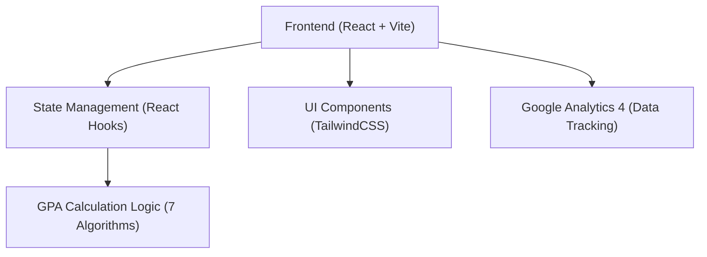

## 1. 架构设计


## 2. 技术说明
- 前端：React@18 + tailwindcss@3 + vite
- 样式方案：TailwindCSS + CSS Variables (遵循“河狸陪”品牌设计规范，定义对应的颜色令牌)
- 部署方案：静态页面部署（Vercel / Cloudflare Pages），纯前端计算，无需后端
- 数据埋点：集成 GA4，并通过自定义事件追踪核心转化路径（页面访问、开始输入、计算完成、CTA点击、分享等）
- 图标库：Lucide React（或类似现代化图标库）

## 3. 路由定义
| 路由 | 目的 |
|-------|---------|
| / | 工具首页（单页应用，包含所有核心输入、计算和展示逻辑） |

## 4. API 定义
本项目为纯前端应用，所有 GPA 换算逻辑均在客户端本地完成，不涉及后端 API 的交互。后续若需提交用户线索，可通过企微二维码扫码完成，无需表单提交 API。

## 5. 核心数据结构与算法设计
### 5.1 课程数据结构
```typescript
interface Course {
  id: string;
  name: string;      // 课程名称
  credits: number;   // 学分
  score: number;     // 分数（百分制或等级制）
}
```

### 5.2 算法映射设计
提供多种算法的计算策略，将原始分数映射为对应算法的绩点：
- 标准 4.0 算法
- 北大 4.0 算法
- 改进 4.0 算法（版本1、版本2）
- 加拿大 4.3 算法
- 中科大 4.3 算法
- 等级制 (Letter Grade) 映射

基于策略模式实现 `calculateGPA(courses: Course[], algorithm: AlgorithmType)`，计算出加权平均绩点。
